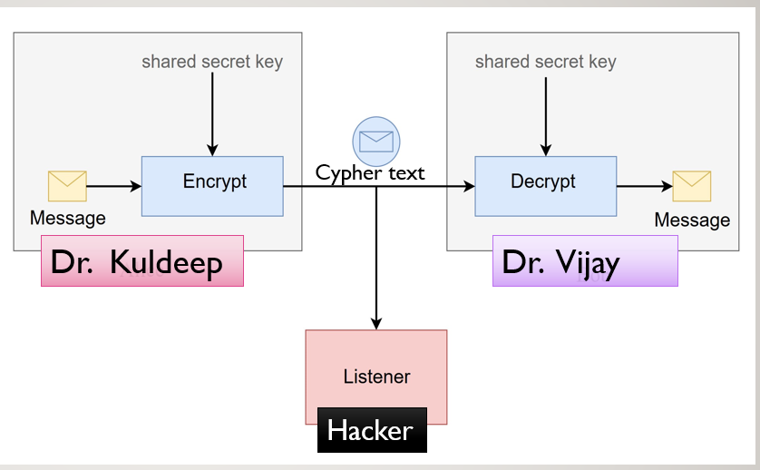

# Adversarial-Neural-Crytography

Neural Cryptography is a branch of cryptography where we deal with ciphertexts and key to decrypt the same. This is done in order to ensure that the message that is sent to the desired person only it is indecipherable by any other party trying to reach the message. 

## We proposed a CNN model to overcome the problem in figure 1 and were able to achieve astonishing results which will be helpful for the future research in this field.

